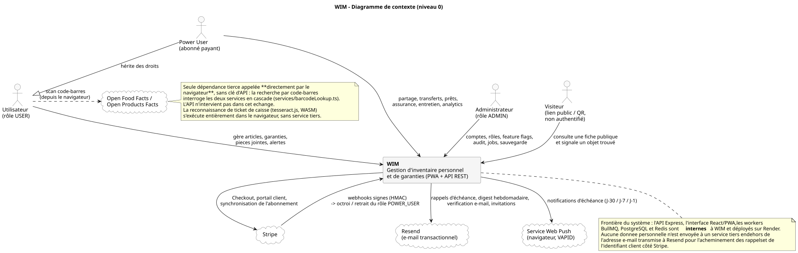
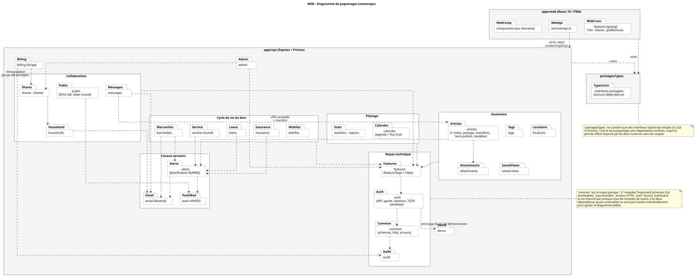
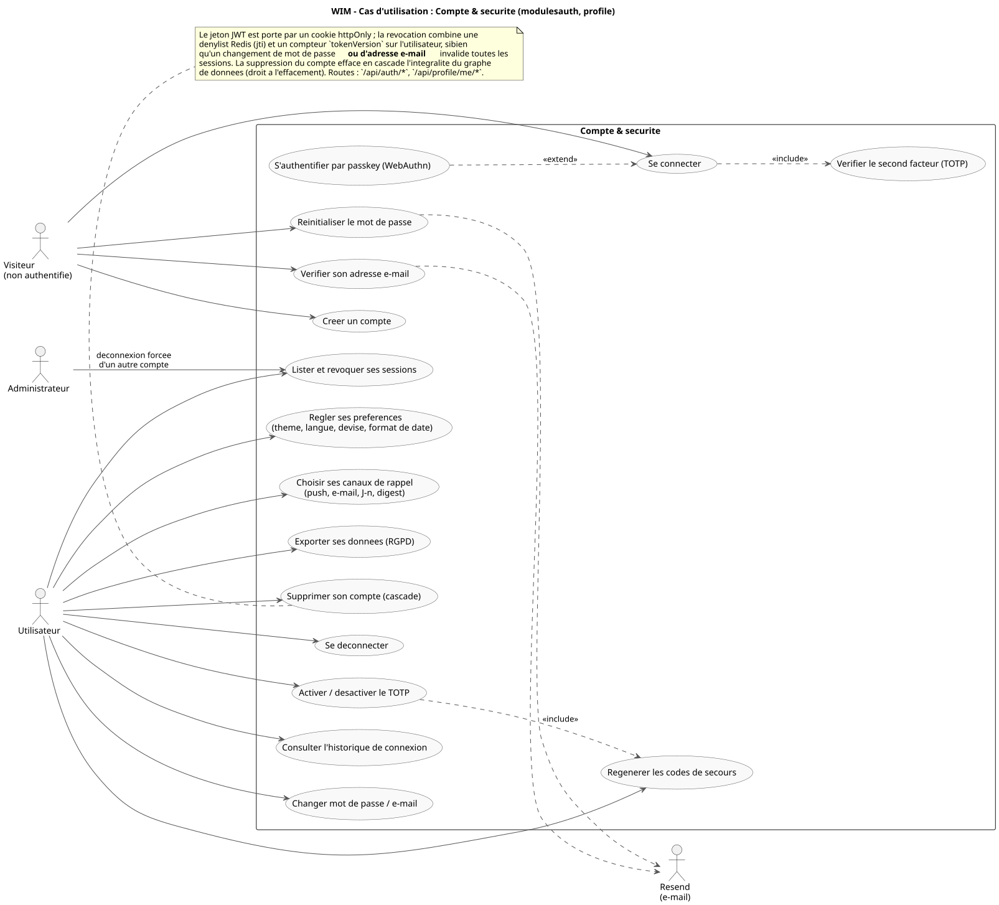
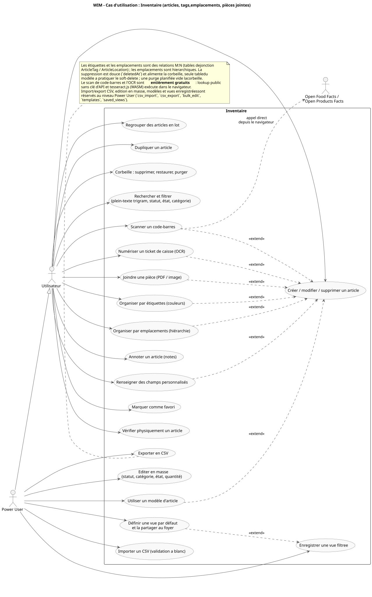
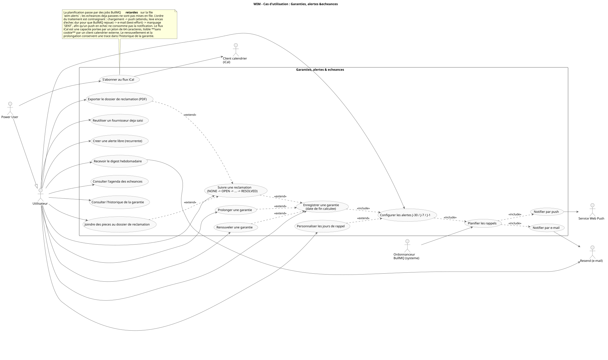
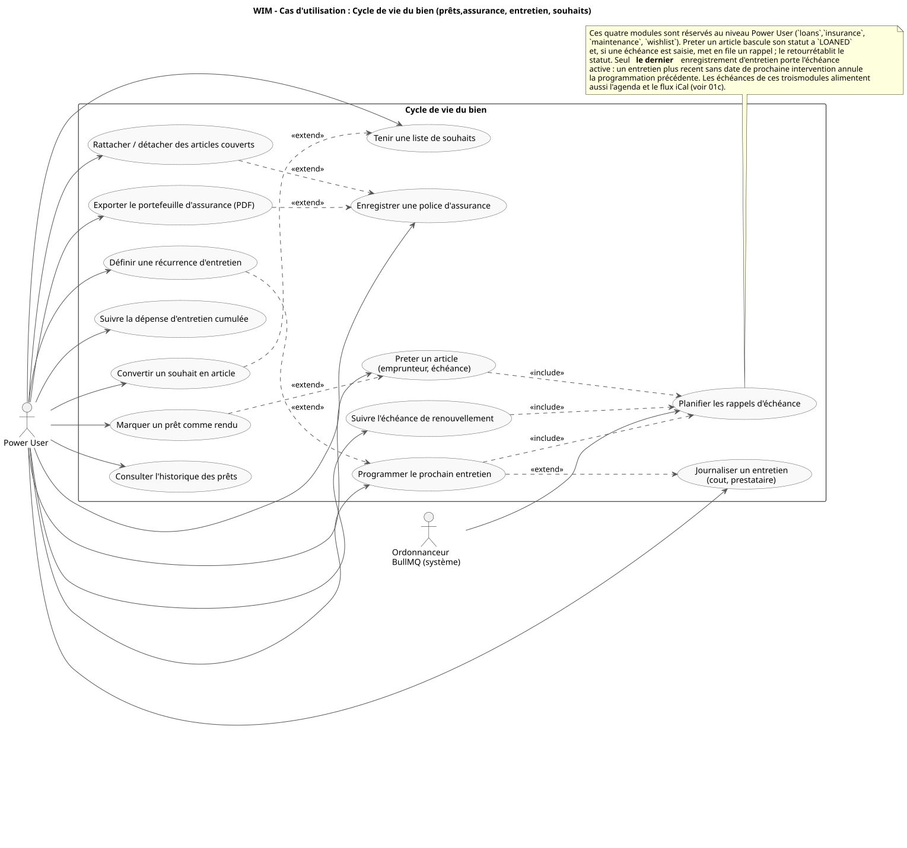
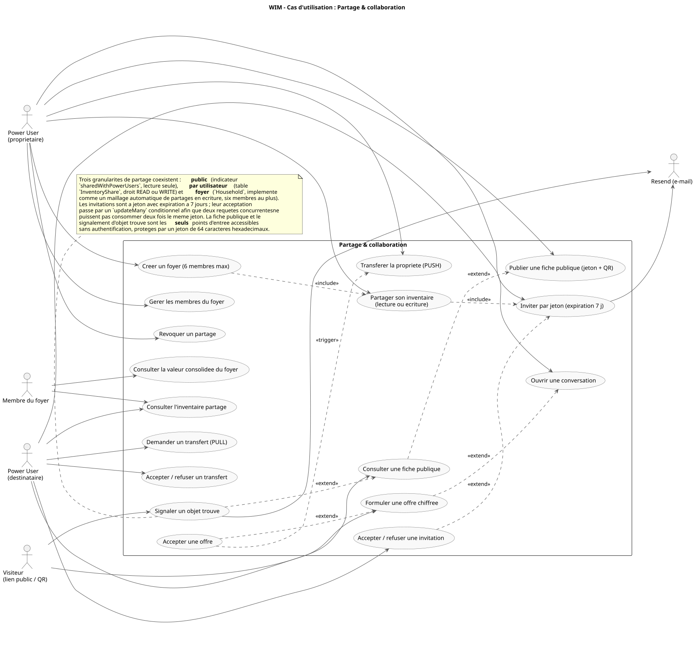
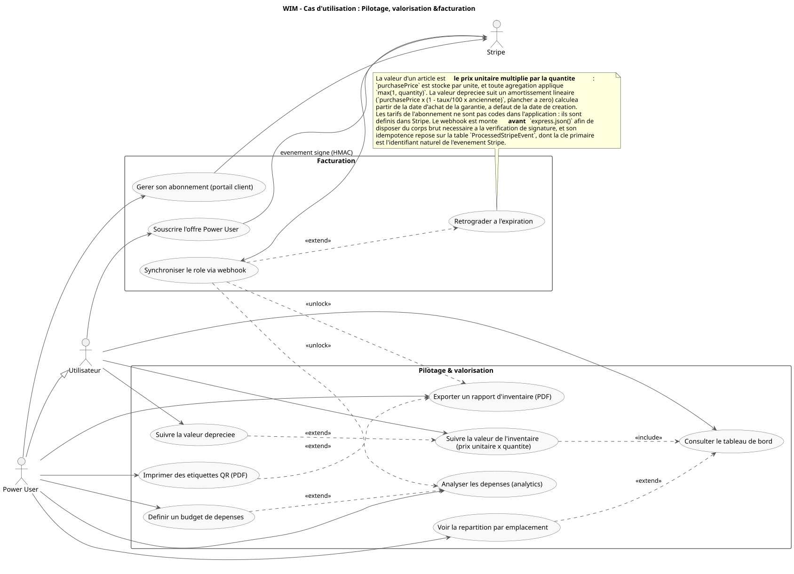
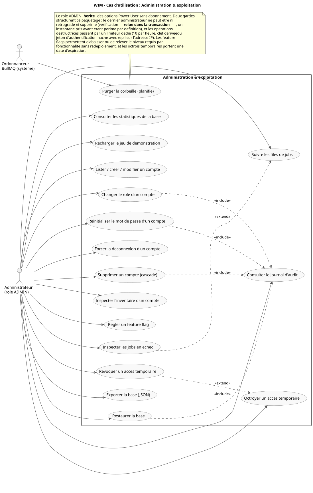
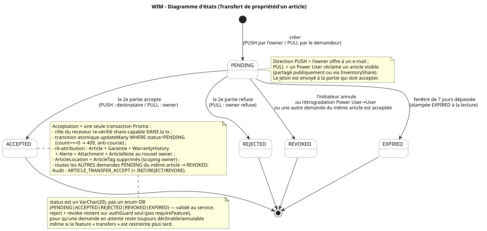

# UML – WIM (Warranty & Inventory Manager)

Ce dossier contient les diagrammes PlantUML du projet, **en français**. Ils
sont tenus alignés sur le code (`apps/api/prisma/schema.prisma`, les routes et
les services) ; la vue d'ensemble en anglais qui relie ces diagrammes au flux
applicatif se trouve dans [`../architecture.md`](../architecture.md). Le
**dictionnaire de données** champ-par-champ (référence exhaustive de toutes les
tables) est dans [`../data-dictionary.md`](../data-dictionary.md).

## Rendu

Les `.svg` versionnés à côté de chaque `.puml` sont la version **rendue**
(affichée directement par GitHub plus bas). La source éditable reste le
`.puml`.

- **Régénérer après avoir édité un `.puml`** : `npm run docs:uml` (à la racine),
  puis committer le `.svg`. Le script (`scripts/render-uml.sh`) rend via l'image
  Docker PlantUML **épinglée** (Graphviz inclus, nécessaire pour les diagrammes
  de classes/états/composants/cas d'usage).
- **CI** : le job `uml` re-rend et échoue si un `.svg` versionné est périmé
  (même logique que le drift-check Prisma). Si la CI signale un écart, lancez
  `npm run docs:uml` et committez.
- Alternative manuelle : une extension PlantUML (VS Code). Le serveur public
  plantuml.com n'est pas utilisé (rendu reproductible via l'image épinglée).

## Conventions de notation (UML)

- **Classes** : composition (losange plein `*--`) pour une appartenance
  exclusive avec cascade delete — le « tout » est le parent dont la FK est
  obligatoire (NOT NULL) ; association (`-->`) pour une FK nullable, un lien
  `onDelete: SetNull` (AuditLog) ou un rôle multiple vers `User` ; `--` pour
  une relation M:N via table de jonction. Multiplicités sur les deux extrémités.
- **Cas d'utilisation** : `<<extend>>` orienté du cas **optionnel** vers le cas
  de **base** ; `<<include>>` du cas de base vers le sous-cas **toujours**
  exécuté ; les dépendances qui ne sont ni l'un ni l'autre portent un
  stéréotype explicite (`<<unlock>>`, `<<trigger>>`).
- **Séquences** : barres d'activation (execution occurrences) sur les lignes de
  vie, messages numérotés (`autonumber`), flèches pleines pour les appels et
  pointillées pour les retours, fragments `alt`/`opt`.
- **États** : pseudo-états initial/final (`[*]`), transitions
  `déclencheur [garde] / effet`.

## Analyse des diagrammes

### `12-contexte.puml` — Contexte (niveau 0)

Situe WIM comme **boîte noire** face à son environnement. PostgreSQL et Redis
n'y figurent pas : ils appartiennent au système et restent à l'intérieur de la
frontière (leur topologie est décrite par `07`). Quatre acteurs humains —
`Utilisateur`, `Power User` (qui en hérite), `Administrateur` et le `Visiteur`
non authentifié qui consulte une fiche publique par QR — et quatre systèmes
tiers : Stripe (bidirectionnel : Checkout sortant, webhooks signés entrants),
Resend pour l'e-mail transactionnel, le service Web Push du navigateur, et
Open Food Facts / Open Products Facts. Ce dernier est le seul appelé
**directement par le navigateur**, sans clé d'API et sans transiter par
l'API : c'est ce qui rend la recherche par code-barres gratuite. La
reconnaissance de ticket de caisse n'apparaît pas comme acteur externe parce
qu'elle s'exécute intégralement dans le navigateur (tesseract.js en WASM).

### `13-paquetages.puml` — Paquetages

Donne la structure du monorepo et, surtout, le **sens** de ses dépendances.
`packages/types` est le seul paquetage sans dépendance sortante, ce qui lui
permet d'être importé par les deux runtimes sans les coupler. Côté API, deux
paquetages jouent un rôle de noyau : `common` (schémas Zod réutilisables,
`asyncHandler`, erreurs HTTP), importé par vingt-et-un modules, et `auth`, qui
fournit `authGuard` à presque toutes les routes — ces deux dépendances quasi
universelles sont résumées par une note plutôt que tracées individuellement,
faute de quoi le diagramme deviendrait illisible. Le reste des arêtes est
extrait des imports réels : `warranties`, `loans`, `insurance`,
`service-records` et `articles` dépendent tous d'`alerts` pour la
planification BullMQ ; `alerts` dépend à son tour des canaux `push` et
`email` ; `billing` dépend de `shares` pour purger les partages lors d'une
rétrogradation ; `messages` dépend d'`articles` parce qu'une offre acceptée
déclenche un transfert. Les modules premium dépendent tous de `features`,
qui porte le paywall.

### `01-use-cases.puml` — Cas d'utilisation (vue d'ensemble)

Cette vue ne porte que la **carte des acteurs** : elle relie les cinq acteurs
aux sept paquetages fonctionnels, sans détailler les cas. Le détail — cas,
`<<include>>`, `<<extend>>` et dépendances stéréotypées — est réparti dans
`01a` à `01g`, qui reprennent exactement le découpage du diagramme de
paquetages. Ce choix est délibéré : la version précédente rassemblait
vingt-neuf cas d'utilisation sur un seul diagramme, ce qui la rendait
difficilement lisible à l'impression et masquait les relations entre cas.

La hiérarchie d'acteurs encode le modèle de droits réel :
`Power User --|> Utilisateur` et `Administrateur --|> Power User`, l'ADMIN
héritant donc des options payantes **sans abonnement**. Un acteur système,
l'ordonnanceur BullMQ, apparaît explicitement : il déclenche les rappels
d'échéance et la purge planifiée de la corbeille sans intervention humaine.

### `01a-uc-compte-securite.puml` — Compte & sécurité

Couvre `/api/auth/*` et `/api/profile/me/*`. Le `Visiteur` porte les cas
pré-authentification (inscription, connexion, réinitialisation, vérification
d'adresse) ; l'`Utilisateur` porte la gestion du compte. La connexion
*inclut* la vérification TOTP lorsqu'elle est armée, et la passkey WebAuthn
*étend* la connexion comme second chemin. La note rappelle l'invariant
central : la révocation combine denylist Redis et `tokenVersion`, si bien
qu'un changement de mot de passe **ou d'adresse e-mail** invalide toutes les
sessions.

### `01b-uc-inventaire.puml` — Inventaire

Le cœur gratuit du produit. Tous les cas d'enrichissement d'un article
(pièces jointes, étiquettes, emplacements, champs personnalisés, scan,
OCR, modèle) *étendent* la création/modification : ils sont optionnels par
construction. La frontière du paywall est visible d'un coup d'œil —
l'`Utilisateur` porte la saisie et l'organisation, le `Power User` l'édition
en masse, les modèles, les vues enregistrées et l'import/export CSV.

### `01c-uc-garanties-alertes.puml` — Garanties, alertes & échéances

Enregistrer une garantie *inclut* la configuration de ses alertes, qui
*inclut* à son tour leur planification ; la planification *inclut* les deux
canaux de notification. L'ordonnanceur BullMQ figure comme acteur système.
La note documente l'ordre contraignant du traitement (push attendu avant le
marquage `SENT`, e-mail best-effort), qui est la raison d'être de cette
séquence.

### `01d-uc-cycle-de-vie.puml` — Cycle de vie du bien

Les quatre modules entièrement réservés au Power User : prêts, assurance,
entretien, liste de souhaits. Trois de leurs cas *incluent* la planification
d'un rappel, ce qui les relie à `01c`. La note consigne la règle non
évidente de l'entretien : seul le **dernier** enregistrement porte
l'échéance active.

### `01e-uc-partage.puml` — Partage & collaboration

Distingue les rôles de part et d'autre d'un partage (propriétaire,
destinataire, membre du foyer) plutôt que de les fondre dans un acteur
unique. Une offre acceptée porte une dépendance `<<trigger>>` vers le
transfert PUSH — ni un `include` ni un `extend`, conformément à la convention
de notation du dossier. Le `Visiteur` n'accède qu'aux deux seuls points
d'entrée non authentifiés du système.

### `01f-uc-pilotage-facturation.puml` — Pilotage, valorisation & facturation

Réunit ce qui mesure et ce qui monétise. Le webhook Stripe porte deux
dépendances `<<unlock>>` vers les cas payants, matérialisant le paywall, et
une `<<extend>>` vers la rétrogradation. La note rappelle les deux règles de
calcul qui sous-tendent tous les chiffres affichés : valeur = prix
**unitaire** × quantité, et amortissement linéaire planché à zéro.

### `01g-uc-administration.puml` — Administration & exploitation

Les actions sensibles (changement de rôle, suppression de compte,
réinitialisation de mot de passe, restauration de la base) *incluent* toutes
l'écriture au journal d'audit. La note consigne les deux garde-fous du
paquetage : l'impossibilité de supprimer ou rétrograder le dernier
administrateur — vérification **relue dans la transaction** — et le limiteur
dédié aux opérations destructrices.

### `02-activity-core-flows.puml` — Activités (ajout & rappels)

Décrit le parcours « ajouter un article » puis le **cycle asynchrone d'un
rappel**. Point de conception clé visible ici : la fin de garantie est
calculée **côté service** (`garantieFin = dateAchat + durée`), pas envoyée par
le client ; et les rappels ne sont pas un balayage quotidien mais des **jobs
BullMQ planifiés** (J-30/J-7/J-1). La branche de livraison reflète l'ordre
exact du code (`reminder.processor.ts`) : **push (obligatoire, rejoué) →
e-mail (best-effort) → markSent**, puis replanification des alertes custom
récurrentes. Cet ordre garantit qu'un push en échec ne « consomme » pas
l'alerte.

### `03-class-diagram.puml` — Classes (modèle de données)

Le modèle complet, fidèle à `schema.prisma` (36 modèles) : 33 sont dessinés
comme classes, les 3 tables de jonction (`ArticleTag`, `ArticleLocation`,
`ArticleInsurance`) étant rendues en associations M:N conformément à la
convention de notation ci-dessus ; la **référence
exhaustive champ-par-champ** vit dans le
[dictionnaire de données](../data-dictionary.md). Couvre l'inventaire, les
garanties, les alertes, le partage, le transfert et la sécurité du compte, plus
les modules par article — prêts (`Loan`), assurance
(`InsurancePolicy`/`ArticleInsurance`), maintenance (`ServiceRecord`) — la
messagerie (`MessageThread`/`Message`) et le feature-gating
(`FeatureFlag`/`FeatureTempGrant`). Le `User` est propriétaire de
tout (articles, emplacements, tags, vues, modèles, audit). Un `Article` porte
0..1 `Garantie`, des `Attachment`, des `Alerte`, des `ArticleNote`, et des
relations **M:N** vers `Location` et `Tag` (tables de jonction
`ArticleLocation` / `ArticleTag`). La `Garantie` archive ses renouvellements
dans `WarrantyHistory` (append-only — la ligne vivante avance, l'état
antérieur est snapshotté). Les `Alerte` pendent de la `Garantie`
(J-30/J-7/J-1) ou d'un article (alertes custom). Le partage repose sur
`ShareInvite` (invitation à jeton) et `InventoryShare` (lien actif
owner→target) ; le transfert de propriété sur `ArticleTransferRequest`
(PUSH/PULL, à jeton). La sécurité du compte s'appuie sur `UserSession` (une
ligne par appareil, jti = clé de denylist Redis), `TotpSecret` (2FA),
`PasswordResetToken` (hash SHA-256) et `PushSubscription` ;
`ProcessedStripeEvent` est le marqueur d'idempotence du webhook. La note
rappelle un choix assumé : les **noms français legacy** (`Alerte*`,
`Garantie`, `articleNom`…) sont conservés pour éviter une migration
coûteuse, alors que les unions partagées `@wim/types` sont en anglais — les
valeurs littérales, elles, coïncident.

### `04-sequence-add-item.puml` — Séquence (ajout article + garantie + alertes)

Détaille les échanges PWA ↔ API ↔ PostgreSQL ↔ BullMQ pour une création, avec
les **vrais chemins** (`POST /api/articles`, garantie embarquée dans le même
corps, pièce jointe via `/api/attachments/upload` → `/uploads/...`). On y voit
le passage par `authGuard` (cookie + `jti` + `tokenVersion`) et `csrfGuard`
sur la mutation, le calcul serveur de `garantieFin`, l'enfilage des jobs
d'alerte, puis le **bloc différé** d'échéance qui rejoue la livraison
push → e-mail → `SENT`.

### `05-state-inventory.puml` — États (réclamation & cycle de vie de l'article)

Remplace l'ancienne machine à états « inventaire » (fictive) par les **deux
machines réelles** du domaine : (a) le **workflow de réclamation de garantie**
(`ClaimStatus` : `NONE → OPEN → APPROVED|REJECTED → RESOLVED`), porté par la
`Garantie` et surfacé sur la timeline, le PDF de réclamation et le flux iCal ;
(b) le **cycle de vie de l'article** en soft-delete
(`Actif → Corbeille → Purgé`, avec restauration). La corbeille s'appuie sur
`deletedAt` : les lectures « live » filtrent `deletedAt = null`, et un worker
de maintenance purge au-delà de `ARTICLE_TRASH_RETENTION_DAYS`.

### `06-sequence-partage.puml` — Séquence (partage par utilisateur)

Le parcours d'un partage direct entre Power Users : création d'une
`ShareInvite` (à jeton), acceptation par le destinataire qui matérialise un
`InventoryShare` actif, puis lecture via `GET /api/shared/articles` (lecture
seule, édition si permission `WRITE`). Deux décisions de sécurité sont
explicites : le gating `requireRole(POWER_USER)` **des deux côtés**, et
l'**absence d'énumération d'e-mails** (même réponse si l'invité est introuvable
ou de mauvais rôle). À noter : `requireRole` s'appuie sur la hiérarchie
`USER < POWER_USER < ADMIN`, donc un **ADMIN hérite du partage** (sans
abonnement) et peut être invité comme un Power User. La note rappelle que
`cleanupSharingForUser` désactive les partages et révoque les invitations lors
d'une rétrogradation, dans la même transaction que le changement de rôle.

### `07-component-deploiement.puml` — Composants / déploiement

Vue d'infrastructure : la PWA (site statique Render) et l'API (service Node
Render) avec ses **workers BullMQ in-process**, adossées à PostgreSQL et Redis,
plus les intégrations externes (Stripe, Resend, Web Push). Pièce maîtresse du
déploiement : le **proxy `/api/*` de `render.yaml`** — le navigateur ne parle
qu'à `wim-web`, qui réécrit côté serveur vers `wimapi`. Sans lui, Safari/iOS
(ITP) bloque le `Set-Cookie` cross-site et la connexion échoue. Le diagramme
met aussi en évidence la **frontière de sécurité** : cookie `httpOnly` +
`SameSite=none` (accès direct API), contrôle `Origin/Referer` sur les
mutations, et le webhook Stripe monté **avant** `express.json()` (signature
HMAC, hors chemin cookie/CSRF). Utile pour relier `architecture.md` à une
image concrète.

### `08-state-alerte.puml` — États (cycle de vie d'une alerte)

La machine à états `AlerteStatus` (`SCHEDULED → SENT | CANCELLED | FAILED`).
Le `snooze` reboucle sur `SCHEDULED` en déplaçant `alerteDate` ; `CANCELLED`
correspond à une suppression de garantie/article ou à une annulation
utilisateur ; `FAILED` n'arrive qu'après épuisement des tentatives BullMQ. La
note insiste sur l'invariant `markSent` **après** push réussi et la
replanification des alertes custom récurrentes.

### `09-sequence-auth.puml` — Authentification & session

Le cycle complet de la session, qui est aussi le **modèle de sécurité** du
produit. À la connexion, l'API signe un JWT portant `sub`, `role`, `jti`
(identifiant aléatoire pour la denylist) et `v` (= `tokenVersion`), posé dans
un cookie `httpOnly` — le JavaScript ne manipule jamais le token — et insère
une `UserSession` (la liste « appareils connectés » du profil). Quand la 2FA
est active (`totpEnabled`), le mot de passe seul ne donne **pas** de cookie :
l'API renvoie un `challengeToken` pré-auth de 5 minutes
(`kind:"totp-challenge"`) et le client doit poster le code TOTP sur
`/auth/login/verify-totp` pour obtenir la vraie session. À chaque requête
protégée, `authGuard` enchaîne : vérification de signature → contrôle du
`jti` dans Redis → relecture de `tokenVersion` et `role` en base. Le
diagramme rend visibles deux mécanismes de révocation complémentaires : la
**denylist par jti** (déconnexion ponctuelle ou révocation d'un appareil) et
le **bump de tokenVersion** (force-logout / reset / changement d'e-mail, qui
invalide *tous* les tokens antérieurs sans toucher à Redis). La comparaison
bcrypt systématique (même utilisateur absent) coupe l'énumération par timing.

### `10-sequence-billing.puml` — Facturation Stripe & rôle

Le passage Power User et son inverse. L'utilisateur part en Checkout Stripe ;
le **webhook est le canal canonique** du changement de rôle, protégé par cinq
gardes empilées (signature → fraîcheur → whitelist de type → marqueur
d'idempotence dans la même transaction que l'effet → `targetRole` validé pour
empêcher une auto-promotion ADMIN). À la rétrogradation, la transaction lance
`cleanupSharingForUser` pour désactiver partages et invitations **de façon
atomique** avec le rôle. Le diagramme montre aussi le **repli `POST
/api/billing/sync`** appelé au retour de Checkout : le cold start de Render
dépassant souvent la fenêtre de retry de Stripe, on interroge Stripe en direct
pour ne pas laisser l'utilisateur bloqué en attendant le webhook.

### `11-state-transfer.puml` — États (transfert de propriété)

La machine à états d'`ArticleTransferRequest`
(`PENDING → ACCEPTED | REJECTED | REVOKED | EXPIRED`, fenêtre de 7 jours) — le
flux le plus complexe du domaine, jusqu'ici uniquement décrit en prose. Une
demande naît `PENDING` en **PUSH** (l'owner offre à un e-mail) ou **PULL** (un
Power User réclame un article qui lui est visible) ; la **2e partie** doit
accepter. L'acceptation est une **seule transaction Prisma** : re-vérification
du rôle share-capable du receveur *dans* la tx, transition atomique
`updateMany WHERE status=PENDING` (anti-course, `count===0` → 409),
ré-attribution de l'article et de toutes ses données liées (garantie, historique,
alertes, pièces jointes, notes), suppression des liens emplacements/tags
(owner-scoped), puis **révocation de toutes les autres demandes PENDING** du même
article. La rétrogradation Power User→User révoque aussi les demandes en attente.
`reject`/`revoke` restent sur `authGuard` seul (sans `requireFeature`) pour
qu'une demande reste toujours déclinable/annulable. Complète le diagramme de
séquence du partage (`06`) côté transfert.

## Correspondance fichiers

| Fichier | Type | Sujet |
| --- | --- | --- |
| `12-contexte.puml` | Contexte | Frontière du système + acteurs et tiers |
| `13-paquetages.puml` | Paquetages | Modules du monorepo et leurs dépendances |
| `01-use-cases.puml` | Cas d'utilisation | Vue d'ensemble : acteurs → paquetages |
| `01a-uc-compte-securite.puml` | Cas d'utilisation | Authentification, 2FA, sessions, RGPD |
| `01b-uc-inventaire.puml` | Cas d'utilisation | Articles, étiquettes, emplacements, pièces jointes |
| `01c-uc-garanties-alertes.puml` | Cas d'utilisation | Garanties, réclamations, rappels, iCal |
| `01d-uc-cycle-de-vie.puml` | Cas d'utilisation | Prêts, assurance, entretien, souhaits |
| `01e-uc-partage.puml` | Cas d'utilisation | Partage, foyer, messagerie, transferts, page publique |
| `01f-uc-pilotage-facturation.puml` | Cas d'utilisation | Tableau de bord, valeur, rapports, Stripe |
| `01g-uc-administration.puml` | Cas d'utilisation | Comptes, feature flags, audit, jobs, sauvegarde |
| `02-activity-core-flows.puml` | Activités | Ajout article/garantie + cycle des rappels |
| `03-class-diagram.puml` | Classes | Modèle de données complet |
| `04-sequence-add-item.puml` | Séquence | Ajout article + garantie + alertes |
| `05-state-inventory.puml` | États | Réclamation de garantie + corbeille article |
| `06-sequence-partage.puml` | Séquence | Invitation + acceptation + lecture partagée |
| `07-component-deploiement.puml` | Composants | Topologie de déploiement |
| `08-state-alerte.puml` | États | Cycle de vie d'une alerte |
| `09-sequence-auth.puml` | Séquence | Connexion, requête protégée, révocation |
| `10-sequence-billing.puml` | Séquence | Checkout Stripe, webhook, sync, rôle |
| `11-state-transfer.puml` | États | Transfert de propriété (PENDING→ACCEPTED/REJECTED/REVOKED/EXPIRED) |
