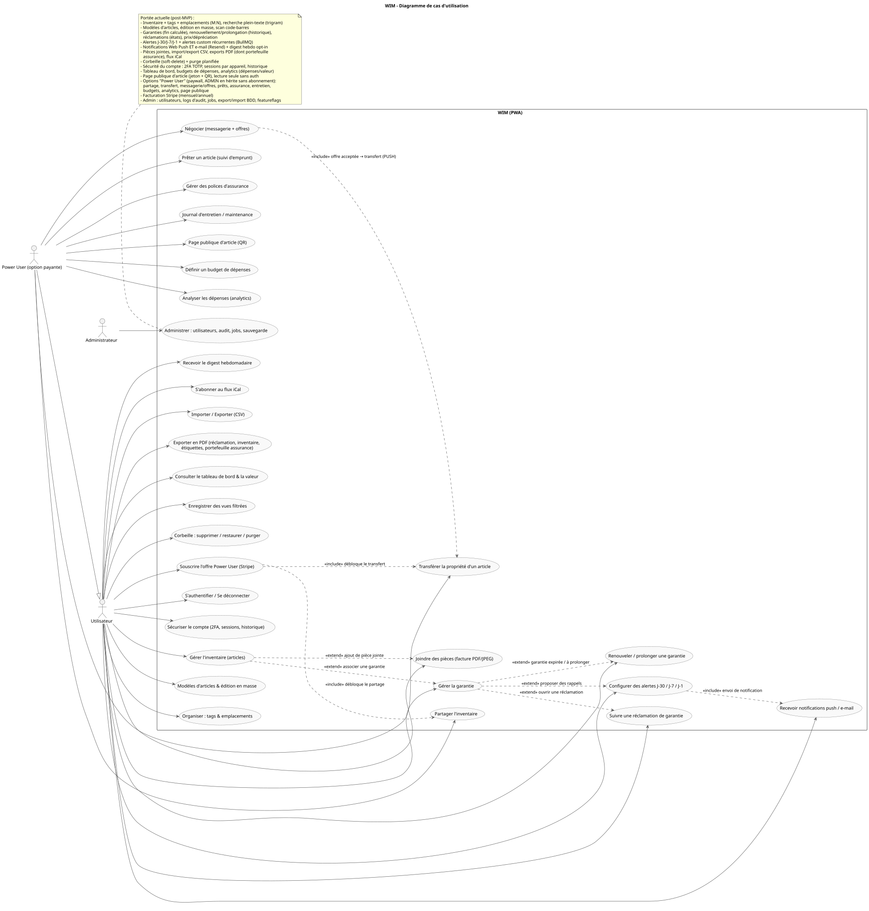
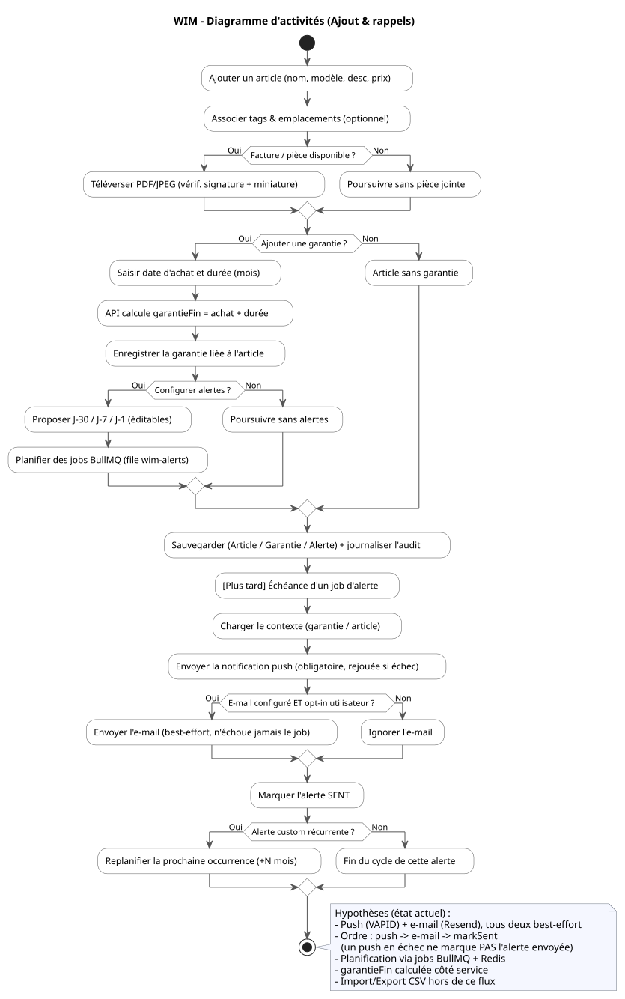
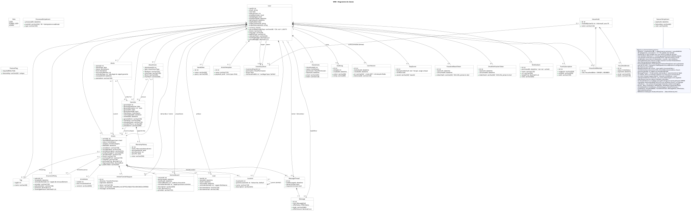
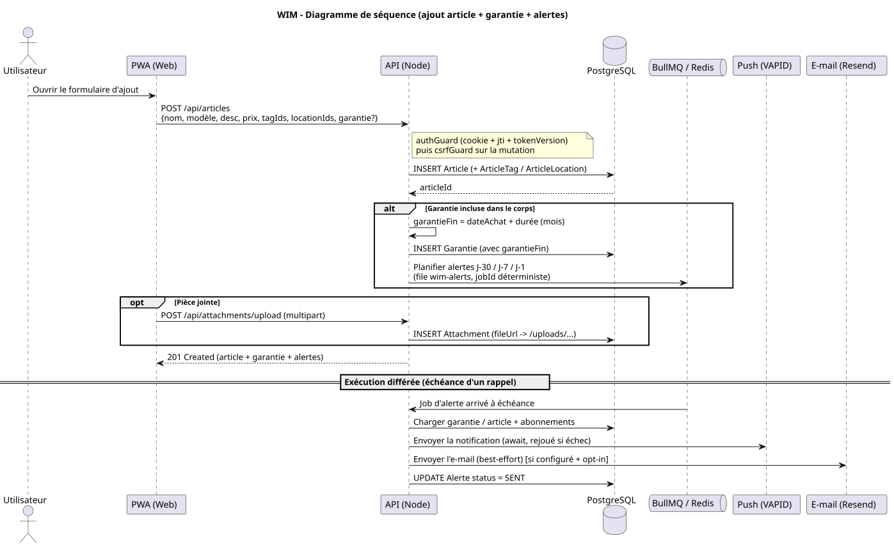
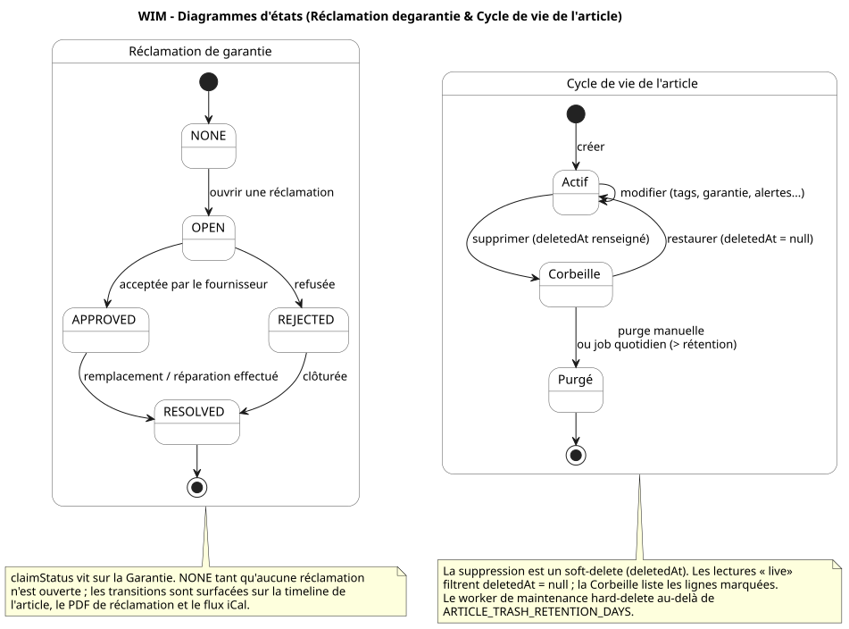
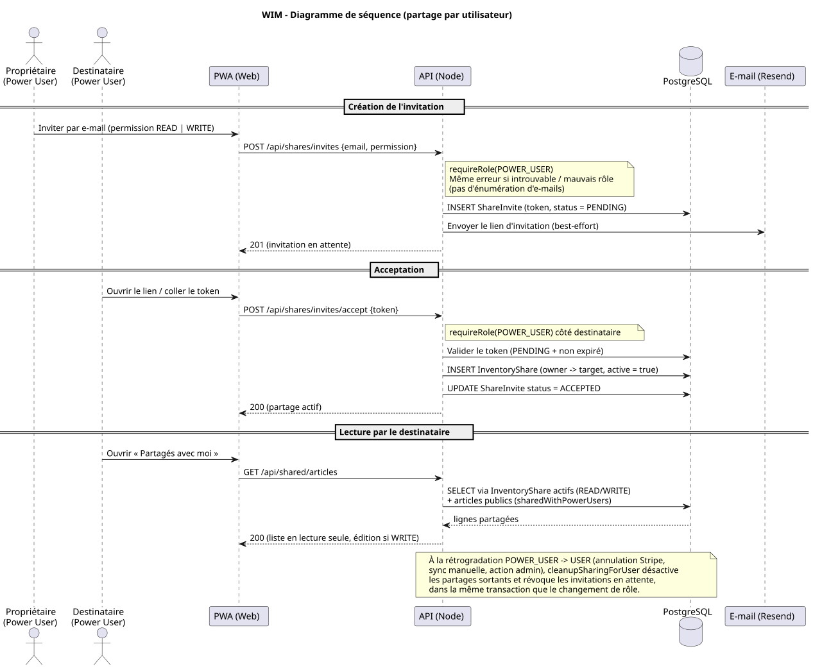
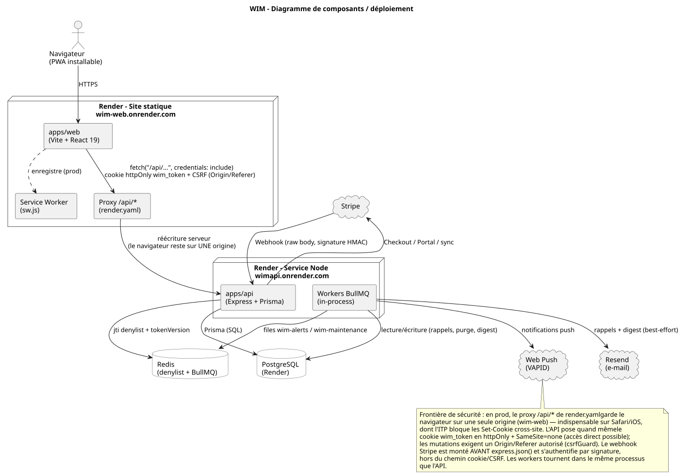
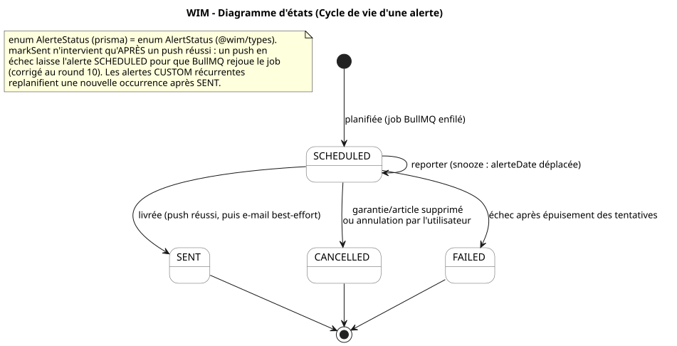
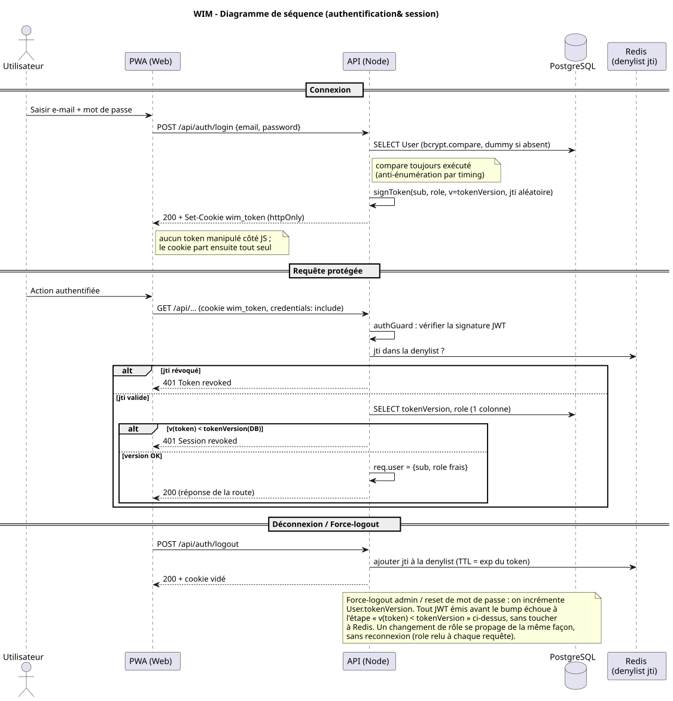
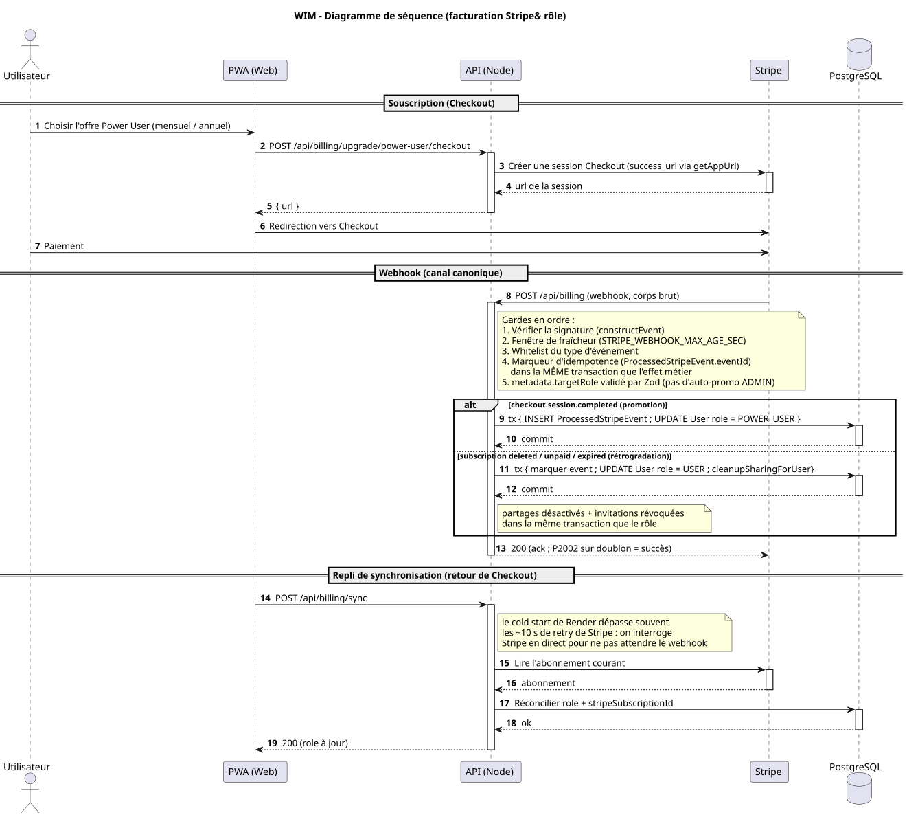

# UML – WIM (Warranty & Inventory Manager)

Ce dossier contient les diagrammes PlantUML du projet, **en français**. Ils
sont tenus alignés sur le code (`apps/api/prisma/schema.prisma`, les routes et
les services) ; la vue d'ensemble en anglais qui relie ces diagrammes au flux
applicatif se trouve dans [`../architecture.md`](../architecture.md).

## Rendu

Les `.svg` versionnés à côté de chaque `.puml` sont la version **rendue**
(affichée directement par GitHub plus bas). La source éditable reste le
`.puml`.

- **Régénérer après avoir édité un `.puml`** : `npm run docs:uml` (à la racine),
  puis committer le `.svg`. Le script (`scripts/render-uml.sh`) rend via l'image
  Docker PlantUML **épinglée** (Graphviz inclus, nécessaire pour les diagrammes
  de classes/états/composants/cas d'usage).
- **CI** : le job `uml` re-rend et échoue si un `.svg` versionné est périmé
  (même logique que le drift-check Prisma). Si la CI signale un écart, lancez
  `npm run docs:uml` et committez.
- Alternative manuelle : une extension PlantUML (VS Code). Le serveur public
  plantuml.com n'est pas utilisé (rendu reproductible via l'image épinglée).

## Analyse des diagrammes

### `01-use-cases.puml` — Cas d'utilisation

Cartographie les fonctionnalités offertes et **qui** y accède. Trois acteurs :
l'`Utilisateur` (socle — y compris la sécurité du compte 2FA/sessions, les
modèles d'articles et le renouvellement de garantie), le `Power User` qui en
hérite (`--|>`) et débloque le **partage** et le **transfert de propriété**
via l'abonnement Stripe, et l'`Administrateur` (utilisateurs, audit, jobs,
sauvegarde BDD). Les relations `<<include>>` / `<<extend>>` encodent les
dépendances réelles : une garantie *étend* un article, des alertes
*étendent* une garantie, l'envoi d'une alerte *inclut* une notification,
l'abonnement *inclut* le déblocage du partage et du transfert. La note de
portée distingue l'état actuel (tags/emplacements, réclamations,
dépréciation, push + e-mail, corbeille, 2FA, facturation) du MVP d'origine,
beaucoup plus restreint.

### `02-activity-core-flows.puml` — Activités (ajout & rappels)

Décrit le parcours « ajouter un article » puis le **cycle asynchrone d'un
rappel**. Point de conception clé visible ici : la fin de garantie est
calculée **côté service** (`garantieFin = dateAchat + durée`), pas envoyée par
le client ; et les rappels ne sont pas un balayage quotidien mais des **jobs
BullMQ planifiés** (J-30/J-7/J-1). La branche de livraison reflète l'ordre
exact du code (`reminder.processor.ts`) : **push (obligatoire, rejoué) →
e-mail (best-effort) → markSent**, puis replanification des alertes custom
récurrentes. Cet ordre garantit qu'un push en échec ne « consomme » pas
l'alerte.

### `03-class-diagram.puml` — Classes (modèle de données)

Le modèle complet, fidèle à `schema.prisma`. Le `User` est propriétaire de
tout (articles, emplacements, tags, vues, modèles, audit). Un `Article` porte
0..1 `Garantie`, des `Attachment`, des `Alerte`, des `ArticleNote`, et des
relations **M:N** vers `Location` et `Tag` (tables de jonction
`ArticleLocation` / `ArticleTag`). La `Garantie` archive ses renouvellements
dans `WarrantyHistory` (append-only — la ligne vivante avance, l'état
antérieur est snapshotté). Les `Alerte` pendent de la `Garantie`
(J-30/J-7/J-1) ou d'un article (alertes custom). Le partage repose sur
`ShareInvite` (invitation à jeton) et `InventoryShare` (lien actif
owner→target) ; le transfert de propriété sur `ArticleTransferRequest`
(PUSH/PULL, à jeton). La sécurité du compte s'appuie sur `UserSession` (une
ligne par appareil, jti = clé de denylist Redis), `TotpSecret` (2FA),
`PasswordResetToken` (hash SHA-256) et `PushSubscription` ;
`ProcessedStripeEvent` est le marqueur d'idempotence du webhook. La note
rappelle un choix assumé : les **noms français legacy** (`Alerte*`,
`Garantie`, `articleNom`…) sont conservés pour éviter une migration
coûteuse, alors que les unions partagées `@wim/types` sont en anglais — les
valeurs littérales, elles, coïncident.

### `04-sequence-add-item.puml` — Séquence (ajout article + garantie + alertes)

Détaille les échanges PWA ↔ API ↔ PostgreSQL ↔ BullMQ pour une création, avec
les **vrais chemins** (`POST /api/articles`, garantie embarquée dans le même
corps, pièce jointe via `/api/attachments/upload` → `/uploads/...`). On y voit
le passage par `authGuard` (cookie + `jti` + `tokenVersion`) et `csrfGuard`
sur la mutation, le calcul serveur de `garantieFin`, l'enfilage des jobs
d'alerte, puis le **bloc différé** d'échéance qui rejoue la livraison
push → e-mail → `SENT`.

### `05-state-inventory.puml` — États (réclamation & cycle de vie de l'article)

Remplace l'ancienne machine à états « inventaire » (fictive) par les **deux
machines réelles** du domaine : (a) le **workflow de réclamation de garantie**
(`ClaimStatus` : `NONE → OPEN → APPROVED|REJECTED → RESOLVED`), porté par la
`Garantie` et surfacé sur la timeline, le PDF de réclamation et le flux iCal ;
(b) le **cycle de vie de l'article** en soft-delete
(`Actif → Corbeille → Purgé`, avec restauration). La corbeille s'appuie sur
`deletedAt` : les lectures « live » filtrent `deletedAt = null`, et un worker
de maintenance purge au-delà de `ARTICLE_TRASH_RETENTION_DAYS`.

### `06-sequence-partage.puml` — Séquence (partage par utilisateur)

Le parcours d'un partage direct entre Power Users : création d'une
`ShareInvite` (à jeton), acceptation par le destinataire qui matérialise un
`InventoryShare` actif, puis lecture via `GET /api/shared/articles` (lecture
seule, édition si permission `WRITE`). Deux décisions de sécurité sont
explicites : le gating `requireRole(POWER_USER)` **des deux côtés**, et
l'**absence d'énumération d'e-mails** (même réponse si l'invité est introuvable
ou de mauvais rôle). À noter : `requireRole` s'appuie sur la hiérarchie
`USER < POWER_USER < ADMIN`, donc un **ADMIN hérite du partage** (sans
abonnement) et peut être invité comme un Power User. La note rappelle que
`cleanupSharingForUser` désactive les partages et révoque les invitations lors
d'une rétrogradation, dans la même transaction que le changement de rôle.

### `07-component-deploiement.puml` — Composants / déploiement

Vue d'infrastructure : la PWA (site statique Render) et l'API (service Node
Render) avec ses **workers BullMQ in-process**, adossées à PostgreSQL et Redis,
plus les intégrations externes (Stripe, Resend, Web Push). Pièce maîtresse du
déploiement : le **proxy `/api/*` de `render.yaml`** — le navigateur ne parle
qu'à `wim-web`, qui réécrit côté serveur vers `wimapi`. Sans lui, Safari/iOS
(ITP) bloque le `Set-Cookie` cross-site et la connexion échoue. Le diagramme
met aussi en évidence la **frontière de sécurité** : cookie `httpOnly` +
`SameSite=none` (accès direct API), contrôle `Origin/Referer` sur les
mutations, et le webhook Stripe monté **avant** `express.json()` (signature
HMAC, hors chemin cookie/CSRF). Utile pour relier `architecture.md` à une
image concrète.

### `08-state-alerte.puml` — États (cycle de vie d'une alerte)

La machine à états `AlerteStatus` (`SCHEDULED → SENT | CANCELLED | FAILED`).
Le `snooze` reboucle sur `SCHEDULED` en déplaçant `alerteDate` ; `CANCELLED`
correspond à une suppression de garantie/article ou à une annulation
utilisateur ; `FAILED` n'arrive qu'après épuisement des tentatives BullMQ. La
note insiste sur l'invariant `markSent` **après** push réussi (corrigé au
round 10) et la replanification des alertes custom récurrentes.

### `09-sequence-auth.puml` — Authentification & session

Le cycle complet de la session, qui est aussi le **modèle de sécurité** du
produit. À la connexion, l'API signe un JWT portant `sub`, `role`, `jti`
(identifiant aléatoire pour la denylist) et `v` (= `tokenVersion`), posé dans
un cookie `httpOnly` — le JavaScript ne manipule jamais le token — et insère
une `UserSession` (la liste « appareils connectés » du profil). Quand la 2FA
est active (`totpEnabled`), le mot de passe seul ne donne **pas** de cookie :
l'API renvoie un `challengeToken` pré-auth de 5 minutes
(`kind:"totp-challenge"`) et le client doit poster le code TOTP sur
`/auth/login/verify-totp` pour obtenir la vraie session. À chaque requête
protégée, `authGuard` enchaîne : vérification de signature → contrôle du
`jti` dans Redis → relecture de `tokenVersion` et `role` en base. Le
diagramme rend visibles deux mécanismes de révocation complémentaires : la
**denylist par jti** (déconnexion ponctuelle ou révocation d'un appareil) et
le **bump de tokenVersion** (force-logout / reset / changement d'e-mail, qui
invalide *tous* les tokens antérieurs sans toucher à Redis). La comparaison
bcrypt systématique (même utilisateur absent) coupe l'énumération par timing.

### `10-sequence-billing.puml` — Facturation Stripe & rôle

Le passage Power User et son inverse. L'utilisateur part en Checkout Stripe ;
le **webhook est le canal canonique** du changement de rôle, protégé par cinq
gardes empilées (signature → fraîcheur → whitelist de type → marqueur
d'idempotence dans la même transaction que l'effet → `targetRole` validé pour
empêcher une auto-promotion ADMIN). À la rétrogradation, la transaction lance
`cleanupSharingForUser` pour désactiver partages et invitations **de façon
atomique** avec le rôle. Le diagramme montre aussi le **repli `POST
/api/billing/sync`** appelé au retour de Checkout : le cold start de Render
dépassant souvent la fenêtre de retry de Stripe, on interroge Stripe en direct
pour ne pas laisser l'utilisateur bloqué en attendant le webhook.

## Correspondance fichiers

| Fichier | Type | Sujet |
| --- | --- | --- |
| `01-use-cases.puml` | Cas d'utilisation | Acteurs + fonctionnalités |
| `02-activity-core-flows.puml` | Activités | Ajout article/garantie + cycle des rappels |
| `03-class-diagram.puml` | Classes | Modèle de données complet |
| `04-sequence-add-item.puml` | Séquence | Ajout article + garantie + alertes |
| `05-state-inventory.puml` | États | Réclamation de garantie + corbeille article |
| `06-sequence-partage.puml` | Séquence | Invitation + acceptation + lecture partagée |
| `07-component-deploiement.puml` | Composants | Topologie de déploiement |
| `08-state-alerte.puml` | États | Cycle de vie d'une alerte |
| `09-sequence-auth.puml` | Séquence | Connexion, requête protégée, révocation |
| `10-sequence-billing.puml` | Séquence | Checkout Stripe, webhook, sync, rôle |
